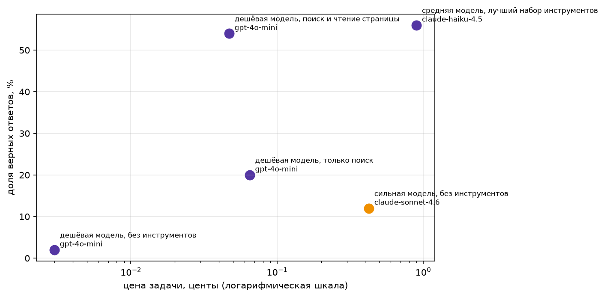

# Домашнее задание 1: свежие вопросы 2026 года и ReAct-агент

Тезис курса: хороший агент на дешёвой модели обходится дешевле сильной модели в одиночку
при том же качестве. Проверяем на вопросах о событиях, которых нет в обучающих данных:
Sonnet 4.6 про 2026 год не знает, а агент с поиском — может узнать.

## Датасет

`data/fresh_2026.jsonl` — **59 вопросов** о событиях 2026 года (в задании сдача названа
`data/fresh.jsonl` — это тот же файл). Тема — хроникальные факты из обзорных статей
Википедии «2026 in …» (страны, науки, виды спорта): 27 страниц-источников, у каждой записи
есть `question`, `answer`, `evidence` (цитата, в которой ответ содержится дословно) и `url`.

Пример записи:

```json
{"id": "fresh-0",
 "question": "What was the death toll from the Casspir incident in Doda, Jammu and Kashmir in January 2026?",
 "answer": "10 soldiers",
 "evidence": "22 January – A Casspir of the Indian Army falls into a gorge in Doda, Jammu and Kashmir, killing 10 soldiers and injuring 10 others.",
 "url": "https://en.wikipedia.org/wiki/2026_in_India", ...}
```

Как собирали: за основу взят стартовый набор семинара (125 вопросов, `homework/fresh_2026.jsonl`,
собран `homework/fetch_fresh.py`), переработан до 59 вопросов: все события произошли после
1 января 2025 года, вопрос самодостаточен, ответ — короткое имя/число/дата, дословно
содержится в цитате. Оставлялись и переписывались только те вопросы, на которые сильная
модель без инструментов отвечает неверно — это и проверяет критерий свежести.

### Проверка свежести

`python3 homework/check_fresh.py data/fresh_2026.jsonl --sonnet` (полный вывод — `check_output.txt`):

```
записей: 59, проблем: 0

Sonnet без инструментов: 0 из 59 верно, 0%. Потрачено $0.103
критерий свежести пройден
```

Доля верных у Sonnet 4.6 без инструментов — 0% (требование: не выше 20%), то есть вопросы
действительно свежие и ответ не угадывается из самого вопроса.

## Агент

`agent_lib.py` — ReAct-цикл с инструментами:

- **`web_search(query)`** — поиск по Википедии (opensearch API): названия релевантных статей
  и первые строки вступлений;
- **`page_find(title, keywords)`** — полный текст статьи (`prop=extracts` без `exintro`),
  возвращает только строки, где встречаются ключевые слова — факты о 2026 годе лежат
  в теле длинных обзорных страниц, вступления не хватает;
- **`calculator(expr)`** и **`python_exec(code)`** — для вопросов с числами и датами.

Цикл: `max_steps=8`, детектор повторов, мягкое завершение, ledger расходов, трейс каждого
прогона в JSON (`traces/<конфигурация>/<модель>/<id>.json`). Ошибки инструментов
возвращаются модели текстом, а не роняют программу.

### Тесты инструментов

По три случая на каждый инструмент — нормальный вход, пустой результат, ошибка — плюс
контракт цикла; запускаются без модели и без ключа:

```
$ python3 test_tools.py
15/15 прошло
```

## Замер

`python3 run_bench.py` — все обязательные конфигурации на всём наборе (59 вопросов),
порог бюджета $5 не превышен: весь замер стоил **~$0.85**.

| Конфигурация | Модель | Верных | Доля | Цена задачи | Цена верного | Ср. шагов | Ср. время |
|---|---|---|---|---|---|---|---|
| сильная модель, без инструментов | claude-sonnet-4.6 | 7/59 | 11.9% | $0.00425 | $0.03578 | 1.00 | 5.9 с |
| дешёвая модель, без инструментов | gpt-4o-mini | 1/59 | 1.7% | $0.00003 | $0.00195 | 1.00 | 6.0 с |
| дешёвая модель, только поиск | gpt-4o-mini | 12/59 | 20.3% | $0.00065 | $0.00317 | 5.46 | 20.3 с |
| **дешёвая модель, поиск и чтение страницы** | gpt-4o-mini | **32/59** | **54.2%** | $0.00047 | $0.00086 | 4.03 | 15.5 с |
| средняя модель, лучший набор инструментов | claude-haiku-4.5 | 33/59 | 55.9% | $0.00900 | $0.01609 | 3.76 | 17.3 с |

Сырые данные: `results_raw.csv`, таблица: `results.md`, картинка:



## Вывод

Тезис курса на этом наборе **подтвердился**. Лучший дешёвый агент (gpt-4o-mini + поиск +
чтение страницы) отвечает верно на 54% вопросов против 12% у Sonnet 4.6 без инструментов —
в 4.5 раза точнее, при этом в 9 раз дешевле за задачу ($0.00047 против $0.00425) и примерно
в 40 раз дешевле за верный ответ ($0.00086 против $0.03578).

Где тезис уточняется:

- **Чтение страницы решает.** «Только поиск» даёт 20% — лишь немногим лучше сильной модели
  без инструментов (12%), потому что факты о 2026 годе лежат в теле обзорных страниц
  («2026 in India» и т.п.), а вступлений не хватает. Показательно, что «только поиск» ещё
  и дороже ($0.00065 против $0.00047) и медленнее (5.5 против 4.0 шагов): без `page_find`
  агент блуждает по статьям.
- **Модель посильнее почти ничего не добавляет.** claude-haiku-4.5 с тем же лучшим набором
  инструментов — 55.9% против 54.2% (+2 вопроса), но в 19 раз дороже за задачу. На свежих
  фактах узкое место — доступ к информации, а не интеллект модели.

## Два разобранных провала

1. **fresh-12 — ответ верный, но не прошёл проверку.**
   Трейс: [traces/дешёвая модель, поиск и чтение страницы/gpt-4o-mini/fresh-12.json](traces/дешёвая%20модель,%20поиск%20и%20чтение%20страницы/gpt-4o-mini/fresh-12.json).
   Агент нашёл факт (`page_find` вернул «28 June – 2026 New Caledonian legislative election»)
   и ответил «28 June 2026», но эталон — «June 28»: нормализованная проверка требует
   дословного вхождения, и другой порядок слов ответ не проходит.

2. **fresh-24 — поиск нашёл не то: источник расходится с эталоном.**
   Трейс: [traces/дешёвая модель, поиск и чтение страницы/gpt-4o-mini/fresh-24.json](traces/дешёвая%20модель,%20поиск%20и%20чтение%20страницы/gpt-4o-mini/fresh-24.json).
   Поиск вывел агента на отдельную статью «Sikhio train disaster» («killing 30 and injuring
   69»), а эталон взят из обзорной «2026 in Thailand» («killing at least 32») — две статьи
   Википедии противоречат друг другу, агент ответил по более специализированной (30 вместо 32).

## Как запустить

```
pip install -r requirements.txt
cp .env.example .env          # и вписать реальный OPENROUTER_API_KEY

python3 test_tools.py                                  # тесты инструментов, ключ не нужен
python3 homework/check_fresh.py data/fresh_2026.jsonl  # формат + дословность, ключ не нужен
python3 run_bench.py                                   # полный замер, тратит ~$1
```

## Структура репозитория

- `agent_lib.py` — инструменты, ReAct-цикл, трейсы, таблица отчёта, график;
- `run_bench.py` — замер всех конфигураций;
- `test_tools.py` — тесты инструментов (15, без модели и ключа);
- `data/fresh_2026.jsonl` — датасет (59 вопросов);
- `homework/` — материалы семинара: `check_fresh.py`, `fetch_fresh.py`, стартовый набор,
  ноутбук, PDF задания;
- `traces/` — трейсы итогового прогона (5 конфигураций × 59 вопросов);
- `results.md`, `results_raw.csv`, `img/money_chart.png` — результаты замера;
- `check_output.txt` — вывод проверки свежести.
